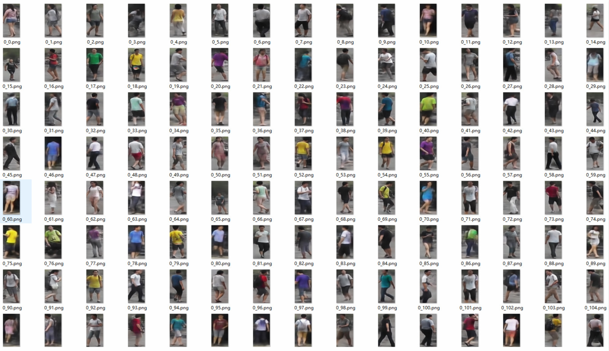

# Reproduction of Pose-Transfer-PATN

Paper: "Progressive Pose Attention Transfer for Person Image Generation"[[pdf]](https://arxiv.org/abs/1904.03349)

This project refers the official code [link](https://github.com/tengteng95/Pose-Transfer), if you find this project useful, please cite the offical paper.

```
@inproceedings{zhu2019progressive,
  title={Progressive Pose Attention Transfer for Person Image Generation},
  author={Zhu, Zhen and Huang, Tengteng and Shi, Baoguang and Yu, Miao and Wang, Bofei and Bai, Xiang},
  booktitle={Proceedings of the IEEE Conference on Computer Vision and Pattern Recognition},
  pages={2347--2356},
  year={2019}
}
```

**用我的滴滴云AI大师码0003在滴滴云上购买GPU/vGPU/机器学习产品可享受9折优惠，[点击](https://www.didiyun.com)前往滴滴云官网**

## Difference from Official Code
- Developed based on the pytorch template [link](https://github.com/lulujianjie/pytorch-project-template) 
- Set hyperparameters using a configuration class
- Added warmup tricks

## Results on Market1501 (SSIM)
| Model | Market1501 |
| --- | -- |
| ResNet50 (128x64)| 0.311 |

<div align=center>

</div>

## Get Started
1. `cd` to folder where you want to download this repo

2. Run `git clone https://github.com/lulujianjie/pose-transfer-PATN.git`

3. Install dependencies:
    - [pytorch>=0.4](https://pytorch.org/)
    - torchvision
    - yacs
    - skimage
    - scipy


## Train

```bash
python train.py
```

## Test

```bash
python test.py
```

